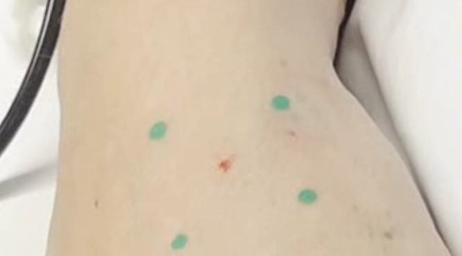
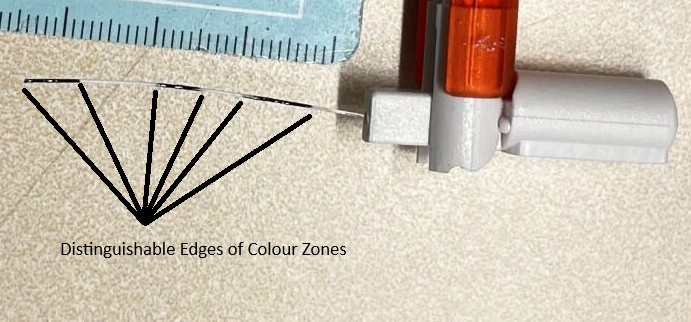
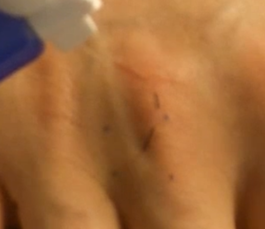
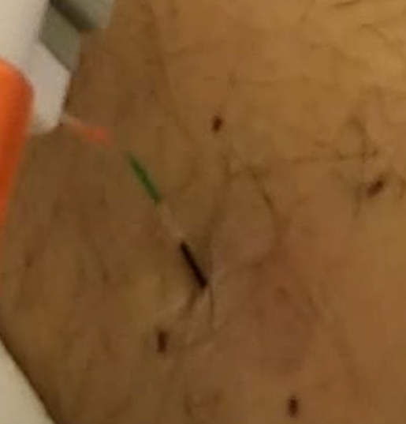
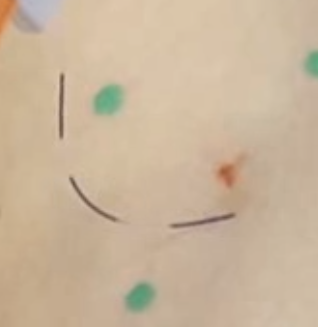

# Recording Instructions and Requirements

For the recording to be properly recognized by the AI model. A few things need to be marked correctly such that it sees the desired points correctly for appropiate post-processing.

The model is designed to detect:
4 dots on the skin that represent the 4 corners of a square with sides of 1 or 2 cm.
A filament with 3 seperate color zones, in order to distinguish 6 points for bending.

## Pre-filming requirements:

- Static clean white lighting for the subject.
- Stationary camera.
- Paint the dots a bright opaque green.
  e.g. [Posca](https://www.posca.com/en/product/pc-5m/) has some paint-type markers, it was what was used for the training.
  e.g. Bright green dots on skin, in a white-lit setting:

- Paint the filament a bright opaque [colour] for 3 defined segments.
  e.g. Example of a filament painted white and dark blue:

- Clean any old dots/blemishes on the skin.

## During-filming requirements:

- For synchronization with neuron data;
  Start the video with 5 touches, roughly 1 per second, at the hotspot.
- No filaments elsewhere within frame during recording.
- Double check recording for bending visibility
  Image 1: Region of interest, the filament, is very blury.
  Image 2: Bend is perpendicular to the cameras reference.
  Image 3: Good image, not blurry, very visible bend.

